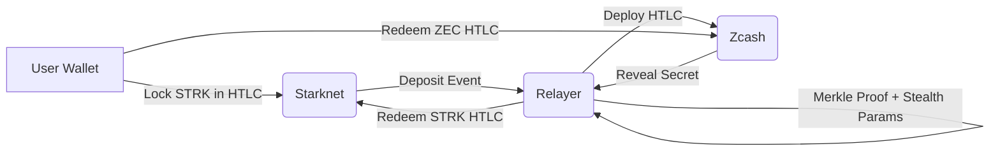

# 🌘 ShadowSwap  
### **Private Cross-Chain Swaps between Starknet ↔ Zcash**

> **Swap STRK ↔ ZEC with privacy, atomic guarantees, and zero trust assumptions.**  
ShadowSwap combines the privacy of Zcash with the scalability of Starknet to deliver **private, non-custodial, atomic cross-chain swaps**.

---

---

# 🚀 Why ShadowSwap?

Today’s swaps are:

- ❌ Public  
- ❌ Traceable  
- ❌ Custodial  
- ❌ Limited to Ethereum-like chains  

**ShadowSwap fixes this** by bridging two powerful ecosystems:

- **🔗 Starknet** — scalable ZK-Rollup  
- **🛡 Zcash** — industry-leading privacy chain  

ShadowSwap enables **private, atomic, cross-chain swaps** using:
- HTLCs  
- Stealth addresses  
- Commitments  
- Range proofs  
- Merkle tree inclusion  
- Automated relayer orchestration  

---

# 🧠 How It Works (Simple)

### **1. User locks STRK in a Starknet HTLC**
- Includes secret hash  
- Private commitment  
- Timeout  

### **2. Relayer observes Starknet**
- Verifies Merkle inclusion  
- Generates stealth parameters  
- Creates matching HTLC on Zcash  

### **3. User redeems Zcash HTLC**
Reveals the **secret**.

### **4. Relayer finalizes Starknet side**
HTLC unlocks → STRK released.

### **5. Atomic refunds if anything fails**
Both sides are safe.

---

# ✨ Features

### 🔒 **Private Swaps**
- Shielded addresses (Sapling/Orchard)  
- Encrypted metadata  
- Commitments + nullifiers  
- No public link between sender ↔ receiver  

### ⚡ **Cross-Chain Atomicity**
- HTLCs on both chains  
- Refund guarantees  
- Fully non-custodial  

### 🤖 **Autonomous Relayer**
- Observes Starknet & Zcash  
- Handles redemptions  
- Auto-refunds  
- Retry + backoff logic  
- Detailed event logging  

### 🌲 **Merkle Proof Engine**
- Tracks Starknet deposits  
- Creates Merkle proofs  
- Syncs with on-chain Merkle root  

### 💱 **On-Chain/Off-Chain Price Router**
- STRK/ZEC/USD pricing  
- Multi-source aggregation  
- Route through Fast/Standard pools  

---

# 🏛 Architecture

# 🔧 Tech Stack

## **Languages & Frameworks**
- 🦀 **Rust**
- ⚡ **Actix Web**
- 🔁 **Asynchronous Relayer Engine**

## **Cryptography**
- ⛓ **HTLCs (Hashed Timelock Contracts)**
- 🕵️ **Stealth Addresses**
- 🔐 **Range Proofs**
- 🧱 **Commitments & Nullifiers**
- 🌲 **Merkle Trees**
- ⚙️ **ZK-Friendly Hash Primitives**

## **Networks**
- ⭐ **Starknet (Cairo 1)**
- 🛡 **Zcash (Sapling / Orchard Shielded Pools)**

---

# 📡 REST API Endpoints

### **POST `/swap/initiate`**
Create a cross-chain swap (STRK → ZEC or ZEC → STRK).

---

### **POST `/indexer/event`**
The indexer sends Starknet/Zcash HTLC events to the backend.

---

### **GET `/price`**
Returns real-time STRK ↔ ZEC ↔ USD pricing.

---

### **GET `/stats`**
Displays global protocol statistics:
- swap volume  
- liquidity usage  
- completed vs pending swaps  

---

### **GET `/metrics`**
Prometheus metrics endpoint for relayer + backend monitoring.

---
## 📬 Team
**Mist Labs**

## 👥 Contributors
### **Okoli Evans**
- GitHub: [@OkoliEvans](https://github.com/OkoliEvans)

### **Kolapo Goodness**
- GitHub: [@Goodness5](https://github.com/Goodness5)

